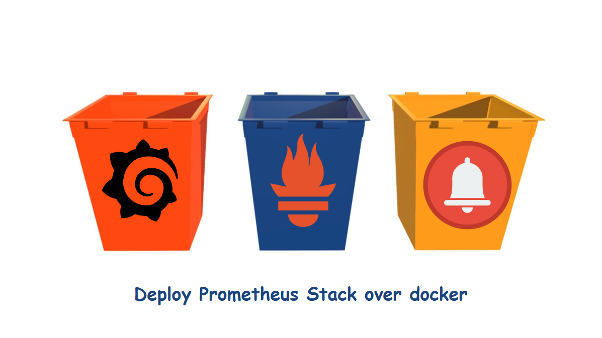

# 📊 Prometheus & Grafana Monitoring Repository



Welcome to the **Prometheus & Grafana Monitoring** repository! This project provides resources and configurations to set up a robust monitoring stack using Prometheus and Grafana.

## 🚀 Features

- **Prometheus**: Collect and store metrics from various sources.
- **Grafana**: Visualize and analyze metrics using customizable dashboards.
- **Nginx**: Use as a reverse proxy for Grafana, ensuring secure and efficient access.
- **Blackbox Exporter**: Monitor endpoints via HTTP, HTTPS, etc...
- **Speedtest Exporter:** Measure and export network speed metrics.
- **PVE Exporter**: Collect metrics from Proxmox Virtual Environment.
- **MKTXP Exporter**: Gather metrics from MikroTik devices.
- **Alertmanager**: Manage and route alerts generated by Prometheus. **By default, alerts are routed to Telegram.**
- **Dockerized Setup:** Everything is configured and deployed easily using Docker Compose.
---

## 📋 Table of Contents

1. [Prerequisites](#prerequisites)
2. [Installation](#installation)
3. [Configuration](#configuration)
4. [Usage](#usage)
5. [Dashboards](#dashboards)
6. [Exporters](#exporters)
7. [Contributing](#contributing)
8. [License](#license)

---

## 🛠 Prerequisites

Before getting started, ensure you have the following installed:

- [Docker](https://www.docker.com/)
- [Docker Compose](https://docs.docker.com/compose/)
- (Optional) Basic knowledge of Prometheus and Grafana.

---

## 📦 Installation

Clone the repository:

```bash
git clone https://github.com/lckrspirit/smalloffice-promstack
cd smalloffice-promstack
```

Start the stack using Docker Compose:

```bash
docker-compose up -d
```

This will:
- Start a Prometheus instance on `http://localhost:9090`
- Start a Grafana instance on `http://localhost:3000`

Default Grafana credentials:
- **Username**: `admin`
- **Password**: `admin`

---

## ⚙️ Configuration

### Prometheus Configuration

Modify the `prometheus.yml` file to:
- Add or update scrape jobs.
- Configure alert rules.

Example snippet:
```yaml
scrape_configs:
  - job_name: 'example'
    static_configs:
      - targets: ['localhost:8080']
```

### Grafana Configuration

Add or customize dashboards in the `grafana/provisioning/dashboards` directory. Use JSON files for importing/exporting dashboards.

---

## 📈 Usage

1. Access Prometheus at [http://localhost:9090](http://localhost:9090).
2. Access Grafana at [http://localhost:3000](http://localhost:3000).
3. Import pre-configured dashboards from the `dashboards/` directory.
4. Explore metrics and set up custom alerts.

---

## 📊 Dashboards

The following dashboards are used in this repository:
- [BlackBox](https://grafana.com/grafana/dashboards/14928-prometheus-blackbox-exporter/)
- [MKTXP Dash](https://grafana.com/grafana/dashboards/13679-mikrotik-mktxp-exporter/)
- [SpeedTest Dash](https://grafana.com/grafana/dashboards/13665-speedtest-exporter-dashboard/)
- [PVE Dash](https://grafana.com/grafana/dashboards/10347-proxmox-via-prometheus/)

To import a dashboard:
1. Open Grafana.
2. Navigate to `Dashboards > Import`.
3. Upload the desired JSON file from the `dashboards/` folder. Alternative method, insert dashboard id. 

---

## 🔌 Exporters

### Included Exporters

- **Node Exporter**: Collects system-level metrics.
- **Custom Exporter**: Example custom metrics exporter.

### Adding Exporters

1. Install the desired exporter.
2. Update `prometheus.yml` with the exporter’s endpoint.

Example:
```yaml
  - job_name: 'node_exporter'
    static_configs:
      - targets: ['localhost:9100']
```

---

## 🤝 Contributing

Contributions are welcome! Please follow these steps:

1. Fork this repository.
2. Create a new branch: `git checkout -b feature-name`.
3. Commit your changes: `git commit -m 'Add new feature'`.
4. Push to your branch: `git push origin feature-name`.
5. Open a pull request.

---

## 📜 License

This project is licensed under the [MIT License](LICENSE).

---

Happy Monitoring! 🎉


